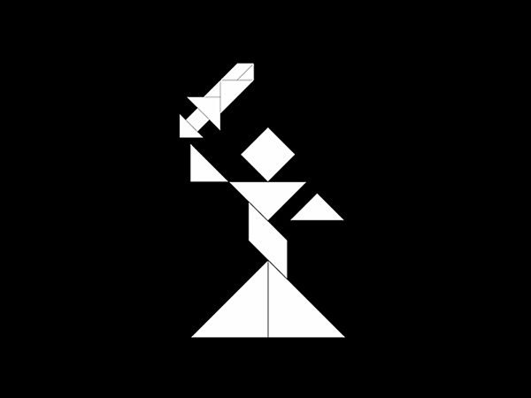
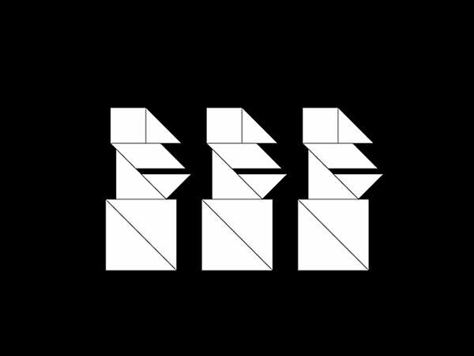
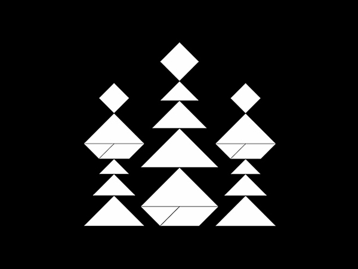
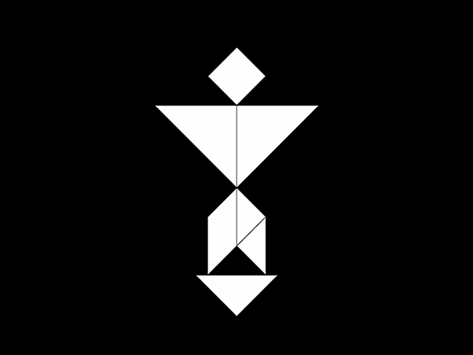
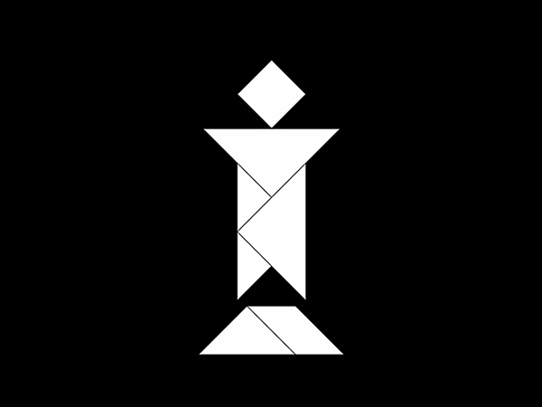
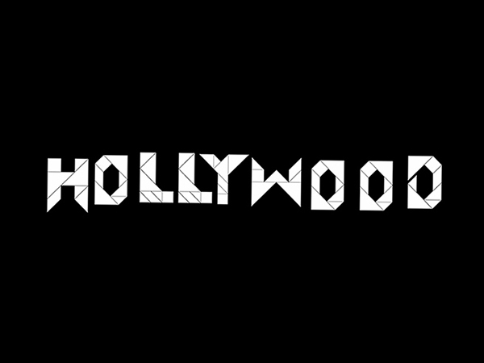
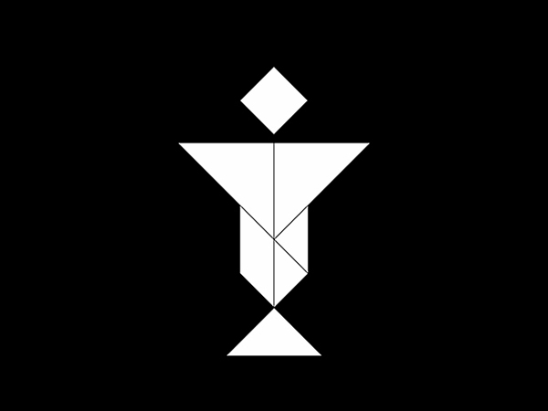

+++
date = "2015-11-18"
title = "Tangram Landmarks"

[taxonomies]

tags = [
  "art",
  "belgrade",
  "hollywood",
  "landmarks",
  "sarajevo",
  "stjepan-filipovic",
  "tangram",
  "world",
  "yugoslavia"
]

[extra]
image = "kostatadic-tangramlandmarks.jpg"
+++

Latin Bridge Sarajevo, Bosnia and Herzegovina (former Yugoslavia) [https://en.wikipedia.org/wiki/Latin\_Bridge](https://en.wikipedia.org/wiki/Latin_Bridge)

Lady Justice Statue London, UK [https://en.wikipedia.org/wiki/Old\_Bailey](https://en.wikipedia.org/wiki/Old_Bailey)

Moai Figures Easter Island, Chile [https://en.wikipedia.org/wiki/Moai](https://en.wikipedia.org/wiki/Moai)

Statue of Liberty Liberty Island, USA [https://en.wikipedia.org/wiki/Statue\_of\_Liberty](https://en.wikipedia.org/wiki/Statue_of_Liberty)

Saint Basil's Cathedral Moscow, Russia [https://en.wikipedia.org/wiki/Saint\_Basil's\_Cathedral](https://en.wikipedia.org/wiki/Saint_Basil's_Cathedral)

Statue of Victory Belgrade, Serbia (former Yugoslavia) [https://en.wikipedia.org/wiki/Pobednik](https://en.wikipedia.org/wiki/Pobednik)

Stjepan Filipovic Monument (destroyed in 1991) Opuzen, Croatia (former Yugoslavia) [https://en.wikipedia.org/wiki/Stjepan\_Filipovi%C4%87](https://en.wikipedia.org/wiki/Stjepan_Filipovi%C4%87)

Stjepan Filipovic Monument Valjevo, Serbia (former Yugoslavia) [https://en.wikipedia.org/wiki/Stjepan\_Filipovi%C4%87](https://en.wikipedia.org/wiki/Stjepan_Filipovi%C4%87)

Hollywood Sign Los Angeles, USA [https://en.wikipedia.org/wiki/Hollywood\_Sign](https://en.wikipedia.org/wiki/Hollywood_Sign)

Christ the Redeemer Rio de Janeiro, Brazil [https://en.wikipedia.org/wiki/Christ\_the\_Redeemer\_%28statue%29](https://en.wikipedia.org/wiki/Christ_the_Redeemer_%28statue%29)

**Related:** [https://www.youtube.com/watch?v=T2Xuy1jZ97E](https://www.youtube.com/watch?v=T2Xuy1jZ97E)
