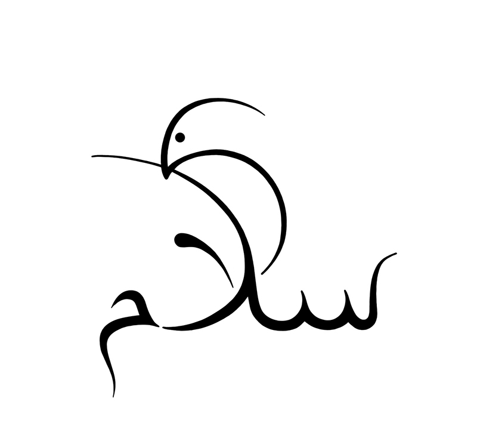

+++
date = "2017-06-08"
title = "Peace (سلام)"

[taxonomies]

tags = [
  "arabic",
  "art",
  "birds",
  "dove",
  "earth",
  "equality",
  "peace",
  "pigeon",
  "word-art",
  "world"
]

[extra]
image = "kostatadic-peace.jpg"
+++

A white dove holding the Arabic word for "peace" instead of an olive branch.

**Related:** [https://www.youtube.com/watch?v=mj04OBBU0Fs](https://www.youtube.com/watch?v=mj04OBBU0Fs)
