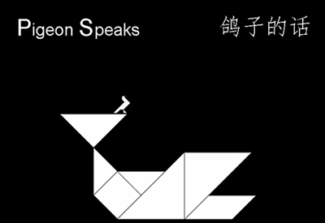
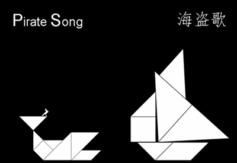
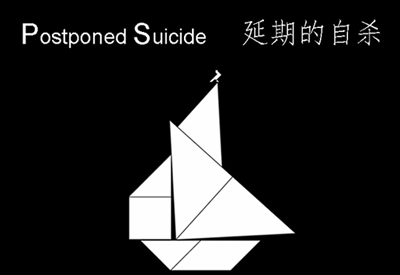
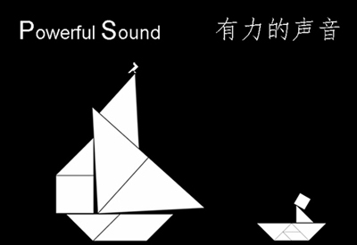
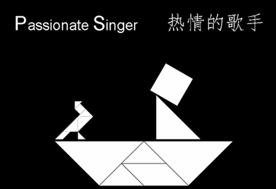

+++
date = "2017-07-25"
title = "Pretty Story (美丽故事)"

[taxonomies]

tags = [
  "art",
  "birds",
  "chinese",
  "dove",
  "love",
  "pigeon",
  "ps",
  "ship",
  "story",
  "tangram"
]

[extra]
image = "kostatadic-prettystory-00.jpg"
+++

What are you looking at? 你在看什么呢？

You’ve never seen a pigeon? Or a dove? 你从没有见过鸽子？或者白鸽？

In fact, I bet you don’t know the difference. 说实话，我打赌你不知道这两个的区别。

Well, don’t worry. Neither do I. I mean, who cares? 好吧，别担心。我也不知道。我是说，谁在乎呢？

A pigeon or a dove? A duck or a seagull? An owl or an eagle? 灰鸽还是白鸽?鸭子还是海鸥？猫头鹰还是老鹰？

I mean, It’s all the same. A bird’s a bird no matter what’s its name. 我的意思是，他们都是一样的。不管叫什么名字，禽鸟都还是禽鸟。

Pigeon Lee was still so young 鸽子Lee还很年轻 But he felt so old 但他已觉得自己很老 He was in the South Seas 他身处南海 But the waves were cold 海浪却冰冷无比

He was tired, he was sad 他疲惫又伤心 And he was alone 他独自一人 There was nothing inside him 他就像一具空壳 His heart turned to stone 他的心已变成石头

There was nothing in this world 他活在这世上 Nothing to live for 已经没有什么意义 There was nothing to admire 没有什么去崇拜 Nothing to adore 没有什么去爱慕

There was not a single reason 没有任何一个理由 For him to live on 让他活下去 There was nothing in his chest 他的胸口空空如也 His heart turned to stone 他的心已变成石头

The pirates were right. 海盗们是对的。 Lee’s heart had turned to stone. Lee的心已变成石头。

He was still alive. 他人还活着。 But the flame of his heart wasn’t burning. 而心的火焰已不再燃烧。

He decided to kill himself. 他决定结束自己的生命。 Because his heart had already died. 因为他的心早已逝去。

But he would do it later. 但他会等会儿再这样做。 When the sky became black like the darkness in his heart. 等到天色变得黑暗，就像他已死的心。

Everything was dark and quiet. Just like Lee’s heart. 一切黑暗又安静。就像Lee的心。

That’s all there is, thought Lee. The silence. 就只有这些了，Lee想。只有寂静。

And it’s the same when the Sun is high. 即使太阳高照也是如此。

Pigeons and people are cooing, but they don’t disturb the silence. 鸽子和人们咕咕地叫，连叫声也没有打扰这寂静。

No one says anything. No one hears anything. 没人说些什么，没人听见什么。

There is no real communication. No real contact. No real touch. 没有真正的交流，没有真正的联系，没有真正的接触。

People and pigeons are kissing, but their lips stay frozen. 人们和鸽子们在接吻，而他们的唇却还保持着僵硬。

There is no real understanding. No real friendship. No real love. 没有真正的理解，没有真正的友谊，没有真正的爱情。

There is nothing in this world. There is nothing in his heart. 这个世界上什么都没有。就像他的心里一无所有。

His heart is dead. He should die too. 他的心已经死了。他也应该随之死去。

He’ll end his empty life. Right here. Right now. 他即将结束他空虚的生命。就在这儿，就在现在。

He’ll jump in the waves and he won’t spread his wings. 他即将跳入这海浪，他不伸展他的翅膀。

He’ll resist the ancient instinct and he won’t fly. 他会反抗飞翔——这一原始的本能。

There is no reason for flying. Only reasons for falling. 已经没有飞翔的理由。仅有坠落。

Lee put his wings tight to his body. He bent his legs in order to jump. Lee让翅膀紧贴着身体。他蜷起腿准备跳下去。

But then he heard something and his legs straightened up. 然后他听到了什么，他的腿又竖直了。

His wings were spread against his will. 他的翅膀违背了他的意志，伸展了开来。

And he flew towards the source of the sound. 他朝着声音的方向飞去。

A beautiful woman was singing. 一个美丽的女人正在歌唱。

Lee didn’t understand the words, but he understood the song. Lee听不懂歌里的词，他却听懂了这首歌。

Because she was singing from the heart. 因为这是她用心唱的歌。

He could feel her heart burning. 他能感觉到她燃烧的心。

Her voice carried those flames and they lightened the night. 她的声音带着火焰，照亮了整个夜晚。

And then they attacked the stone in his chest. 然后火焰冲向他胸中的那块石头。

He burst into tears and his sight got dim. 他的眼泪夺眶而出，他的视线模糊了。

When he got himself together he was alone. 等他重新振作起来，又只剩下他一个人。

The lady had disappeared. 女士消失了。

But Lee could still feel her echo. 但Lee还能感受得到她的回声。

He could still feel the fire of her heart. 他还能感受得到她心的火焰。

His heart was burning too. It was alive again. 他的心也燃烧了。它又重新活了起来。

He didn’t want to die anymore. He wanted to live. 他不想舍弃自己的生命了。他想要活下去。

He wanted to fly and burn like the Sun. 他想要飞，他想要像太阳一样燃烧。

Because he wouldn’t be the only one. 因为他将不再是一个人。

_**2012**_

Originally published in _Just Friends_ in 2013. Translated into Chinese by Li Chengcheng.

**Related:** [https://www.youtube.com/watch?v=dGNe4vxS0GM](https://www.youtube.com/watch?v=dGNe4vxS0GM)
