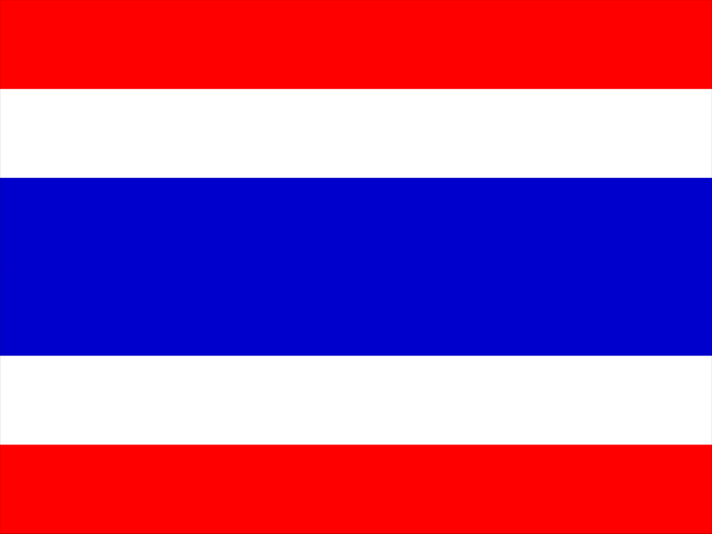

+++
date = "2017-07-30"
title = "Southeast Europe and Southeast Asia"

[taxonomies]

tags = [
  "animation",
  "art",
  "earth",
  "equality",
  "gif",
  "home",
  "peace",
  "star",
  "thai",
  "thailand",
  "world",
  "yugoslavia"
]
+++

Yugoslavia and Thailand.

Two members of the Non-Aligned Movement.

[https://en.wikipedia.org/wiki/Non-Aligned\_Movement](https://en.wikipedia.org/wiki/Non-Aligned_Movement)
