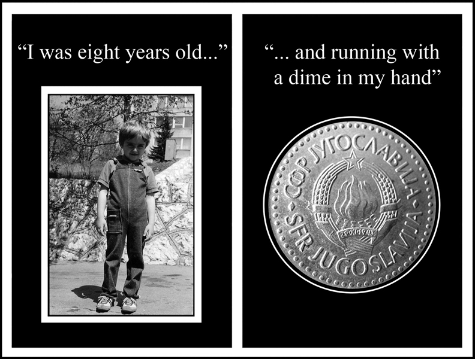
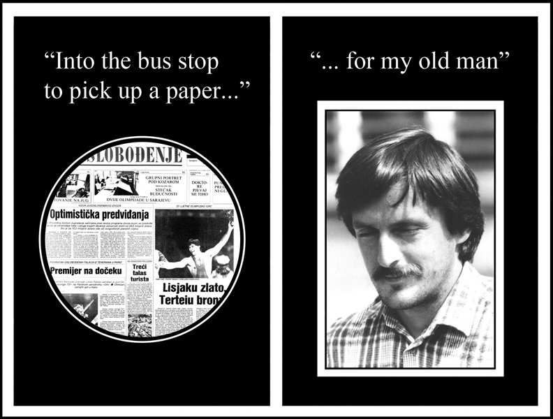
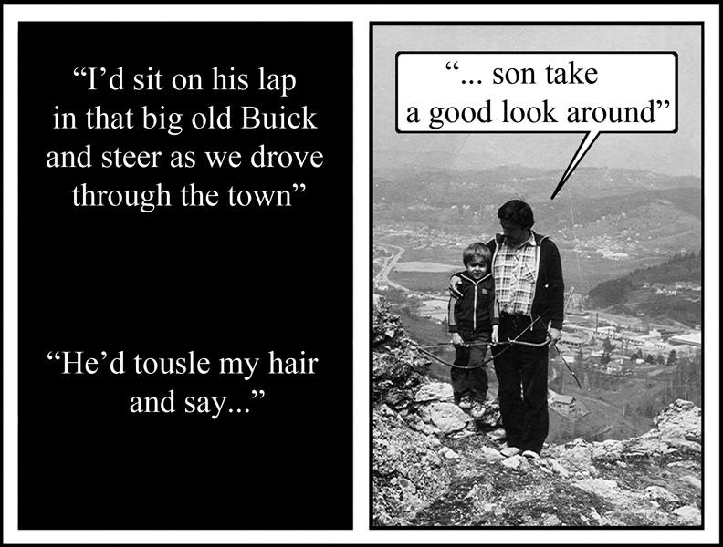
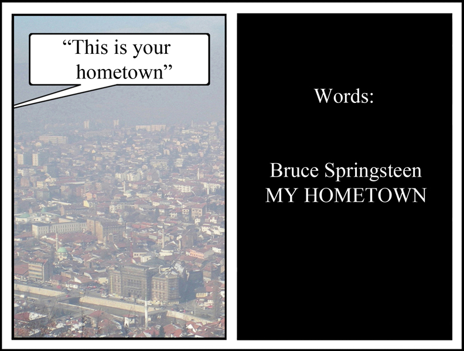

+++
date = "2017-08-10"
title = "My Hometown"

[taxonomies]

tags = [
  "art",
  "home",
  "momdad",
  "my-hometown",
  "photo",
  "sarajevo",
  "war",
  "yugoslavia"
]

[extra]
image = "kostatadic-myhometown.jpg"
+++

