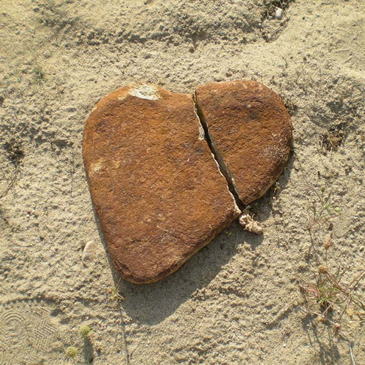

+++
date = "2017-08-17"
title = "Come On Break My Heart"

[taxonomies]

tags = [ "heart", "judas", "love", "poetry", "treason" ]
+++

Come on, break my heart, you won’t be the first  
Come on, drink my blood, satisfy your thirst  
Come on, use my love until you get high  
Then give me a smile and wave me goodbye  

Come on, break my heart, I am used to it  
Come on, break it hard, walk all over it  
Come on, use my love till you learn to fly  
And then touch the sky with another guy  

Come on, break my heart, and feel free to leave  
It won’t make me smart, I will stay naive  
I won’t play your games, I will still believe  
I will still be wearing my heart on my sleeve  

‘Cause it will survive, it will love again  
‘Cause nothing can kill the Heart of a Man  

Photo credit: Milutin Tadic
