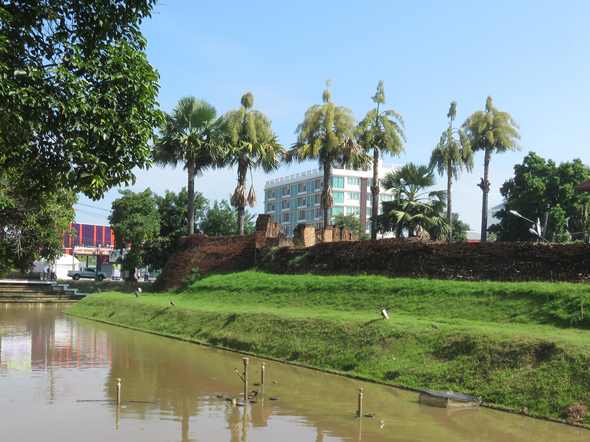

+++
date = "2017-11-10"
title = "Dissecting Chiang Mai: Outside the Old Town"

[taxonomies]

tags = [
  "alcoholism",
  "dissecting-chiangmai",
  "landmarks",
  "photo",
  "poorrich",
  "story",
  "thai",
  "thailand",
  "tourism"
]
+++

Yesterday morning I went to the Chiang Mai Ram Hospital. I have been going there since I quit drinking in June, at least once a month. I relapsed in the meantime, but I am sure it was just one step back and two steps up. My doctor changed my medication and I have never felt better. I am sure that he knows what he is doing. His English is perfect and he knows exactly how I feel even before I tell him. And his sense of humour is really amazing, and it helps as much as the medication.

And I am pleasantly surprised by the hospital itself. It is modern, clean and very well organized. Even the nurses speak English, and most of them look like the Thai movie stars. I almost fall in love every time they measure my blood pressure. And the hospital services are very affordable, even to me. I think that Westerners would call them ridiculously cheap considering their quality.

Speaking of foreigners, there is one funny thing. Most of the patients there are Thais, but most of the patients at the psychiatric unit are from the Western countries. When I see a white person entering the hospital at the same time as me, I just know we will meet again on the fifth floor. And it always comes true.

But I am not writing all this because of the hospital itself (and I am certainly not being paid to advertise it). The hospital is located just outside the edges of the city centre, the area surrounded by the remains of the old walls which once used to protect the city. The walls themselves are surrounded by channels, and the hospital is just across the street of one of them.

The city centre, or "the old town" is the centre of the Chiang Mai's nightlife, and most of the bars, hotels and restaurants are located there or around it. While I was still drinking, I went to a few places, and my ex used to drag me to some restaurants and nightclubs there, but in general, I have been avoiding that part of Chiang Mai. It is full of tourists and I don't want the Thai people to think that I am one of them, just another foreigner who has come to their amazing country to get cheap drinks and to enjoy their beautiful women for little money. And I know it is not the real Chiang Mai, anyway. It is just a big hotel made for tourists.

I have a huge respect for Thailand, for its culture and its people. And I stick to the areas with no foreigners, trying to see the real life of the kind and polite Thai people. And honestly, I haven't been moving much since I quit drinking, and I rarely go far from the University area. So, the only moments that I spend near the old town are those when I come to see my doctor.

I always walk to the hospital. It is a 50-minute walk, but my appointments are always in the morning when it's not too hot. And I always come early, so I cross the street and have a few cigarettes next to the channel and the city wall. I stand right next to the one of the busiest roads in the city, and the numerous cars and bikes are just buzzing along, but I don't hear them at all. I just smoke and look at the still water and the very old bricks of the wall, which have been standing there for centuries. Standing in a tree shade, I feel calm and peaceful, as if I was the part of that ancient city myself.

And this is the memory of the old town I will bring back home from Chiang Mai. Not the bars, not the old temples, not even the beautiful girls from all over the world, but that water and those bricks in the early morning. I am sure I will never forget them and their unique and dignified beauty.

**_20/10/2017_**

