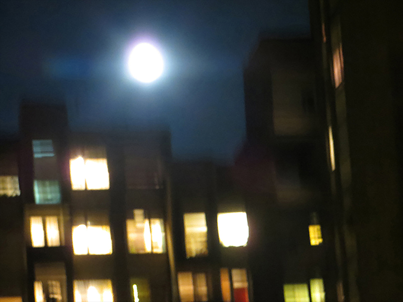
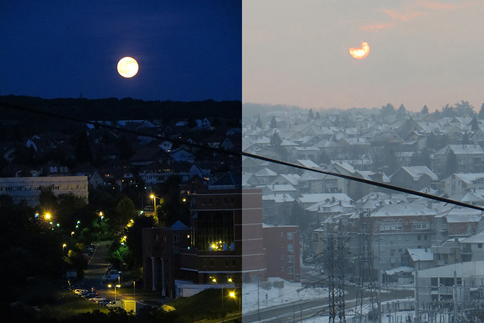
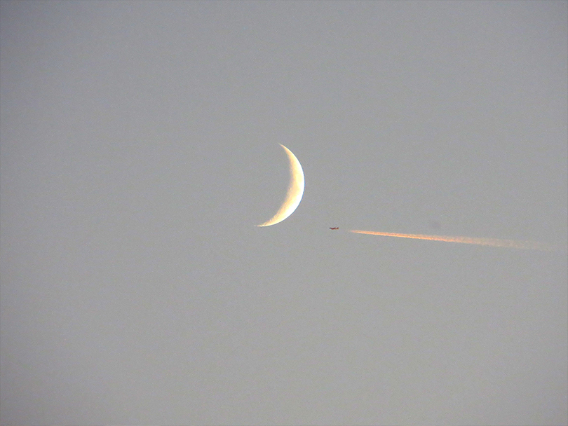
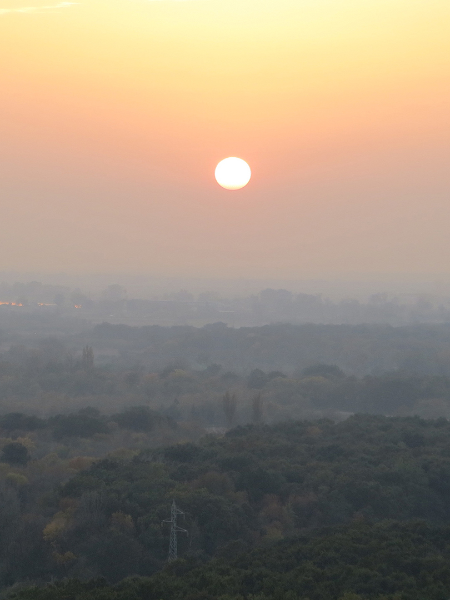
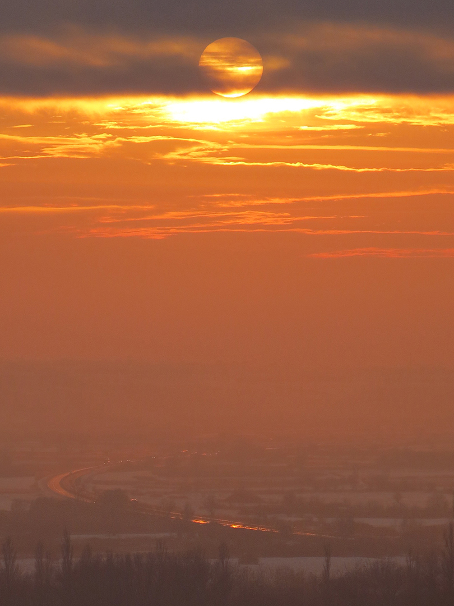
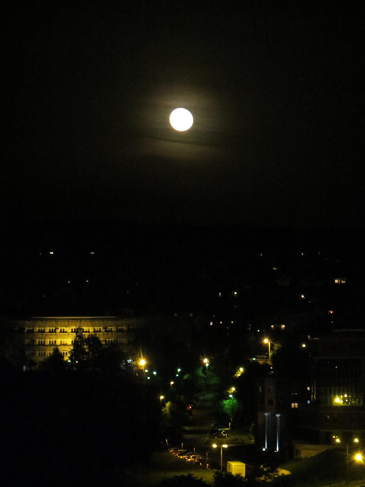
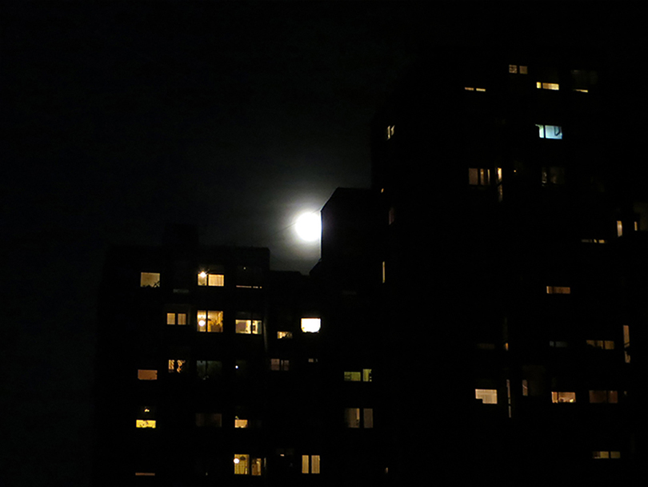
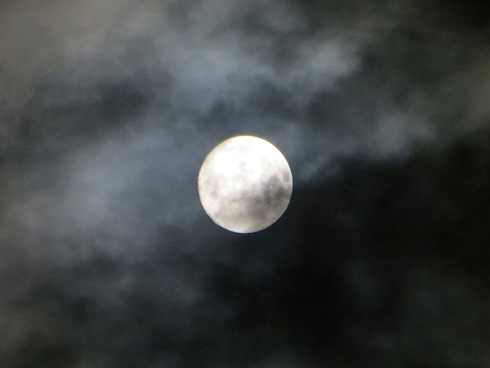
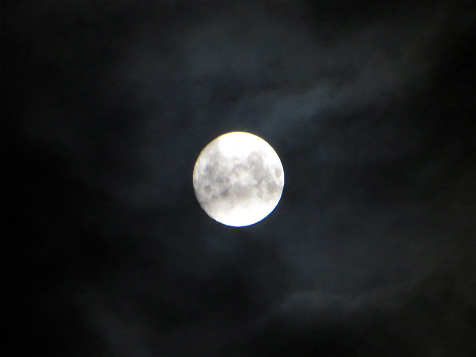

+++
date = "2017-11-10"
title = "The Suns & the Moons"

[taxonomies]

tags = [ "belgrade", "moon", "photo", "sun", "thisthat", "yugoslavia" ]

[extra]
image = "kostatadic-sunsmoons.jpg"
+++

Belgrade, 2014 [https://en.wikipedia.org/wiki/Julino\_Brdo](https://en.wikipedia.org/wiki/Julino_Brdo)

**Related:** [https://www.youtube.com/watch?v=oFd\_DDC49Ak](https://www.youtube.com/watch?v=oFd_DDC49Ak)
