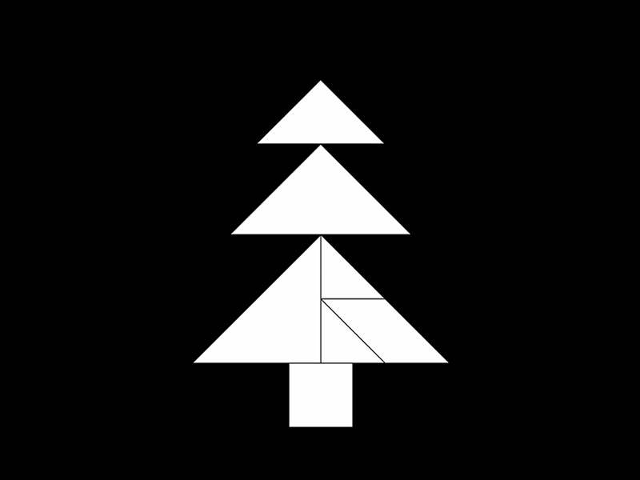
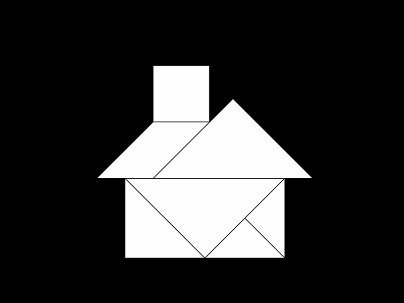

+++
date = "2017-11-28"
title = "Why I Like Beavers"

[taxonomies]

tags = [
  "art",
  "beaver",
  "heart",
  "home",
  "love",
  "peace",
  "story",
  "tangram",
  "tree"
]

[extra]
image = "kostatadic-beavers-1.jpg"
+++

Because there are good guys. They don't kill other animals. Not even for food. They only eat trees.

Because they are smart, patient and hard-working. They invest a lot of time, energy and planning in making a safe and cozy house.

Because they are faithful to their lovers. They never leave their partner. They know what the real love is.

They are good and peaceful guys, but they are brave too. If someone attacks their family, they will fight back. They will fight so hard that even a wolf will run away.

Because they are excellent divers. They love being underwater. Just like me.

And yes, I like those beavers, too. :)
