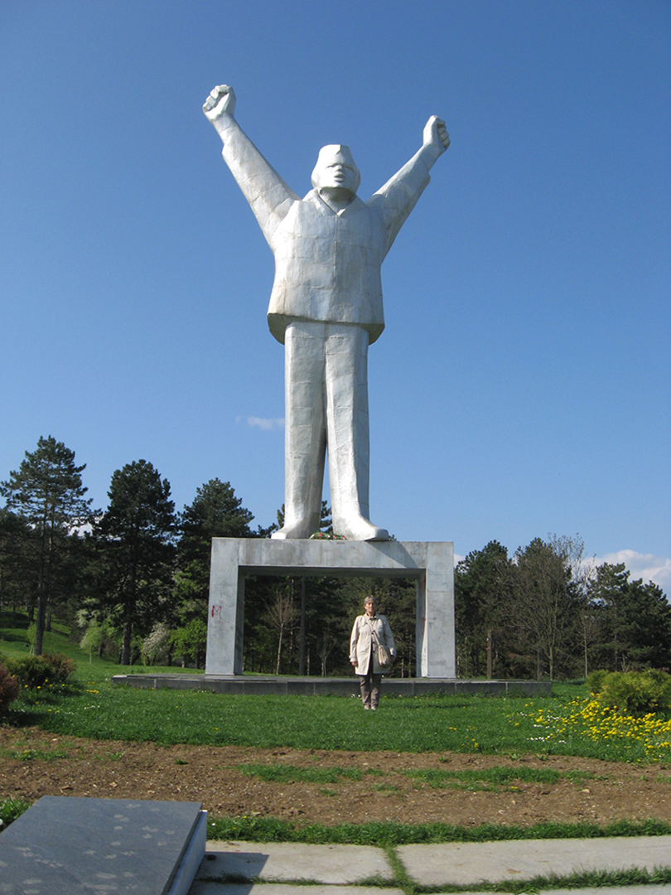

+++
date = "2018-01-22"
title = "The Kindest Yugoslav & the Bravest Yugoslav"

[taxonomies]

tags = [
  "home",
  "landmarks",
  "love",
  "momdad",
  "photo",
  "stjepan-filipovic",
  "thisthat",
  "yugoslavia"
]

[extra]
image = "kostatadic-kindestbravestyugoslav.jpg"
+++

My mother and Stjepan Filipovic: [https://en.wikipedia.org/wiki/Stjepan\_Filipovi%C4%87](https://en.wikipedia.org/wiki/Stjepan_Filipovi%C4%87)

Photo credit: Zlatica Damnjanovic
