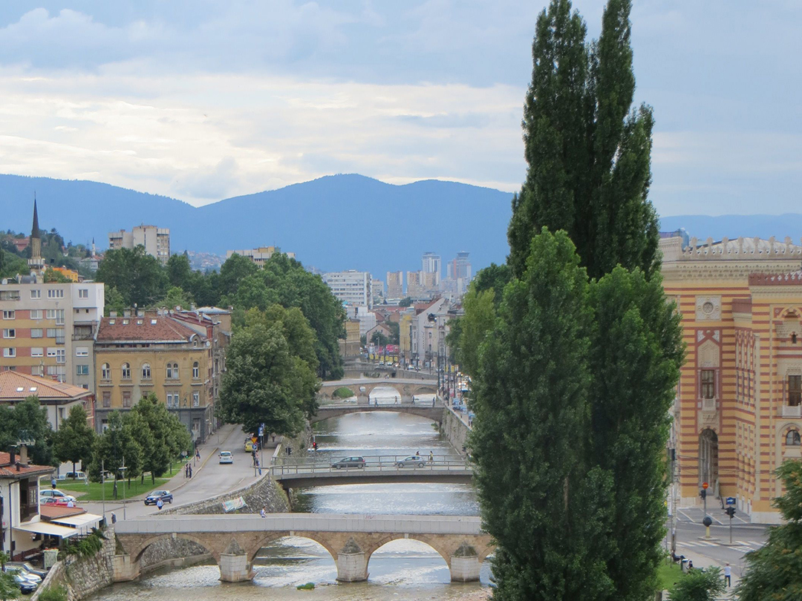

+++
date = "2018-03-07"
title = "My Hometown (ในภาษาไทย)"

[taxonomies]

tags = [
  "home",
  "landmarks",
  "my-hometown",
  "nai-pasa-thai",
  "photo",
  "sarajevo",
  "story",
  "thai",
  "yugoslavia"
]

[extra]
image = "kostatadic-myhometown-thai.jpg"
+++

ผมเกิดสามสิบห้าปีที่แล้ว

ผมเกิดที่เมืองซาราเยโว

ตอนนั้นซาราเยโวเป็นเมืองของประเทศยูโกสลาเวีย

สามสิบสามปีที่แล้วซาราเยโวเป็นเจ้าภาพกีฬาโอลิมปิกฤดูหนาว

ยี่สิบห้าปีที่แล้วสงครามปะทุและครอบครัวของผมต้องออกจากซาราเยโว

ตอนนี้ซาราเยโวเป็นเมืองหลวงของประเทศบอสเนีย

ซาราเยโวสวยมากและตั้งอยู่ท่ามกลางภูเขา

ทุกเวลาผมดูดอยสุเทพผมคิดถึงซาราเยโว

Photo credit: Milutin Tadic
