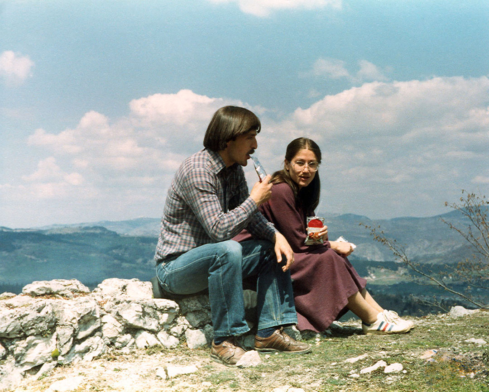

+++
date = "2018-03-07"
title = "My Parents (ในภาษาไทย)"

[taxonomies]

tags = [
  "friendship",
  "home",
  "love",
  "momdad",
  "nai-pasa-thai",
  "photo",
  "sarajevo",
  "story",
  "thai",
  "yugoslavia"
]
+++

พ่อของผมและแม่ของผมตื่นนอนพร้อมกัน

พ่อและแม่กินข้าวเช้าด้วยกันเสมอ

พ่อและแม่อายุเท่ากัน

พ่อและแม่ชื่อคล้ายกัน

ชื่อเล่นของพ่อและชื่อเล่นของแม่เหมือนกัน

ผมรักพ่อแม่ของผม

