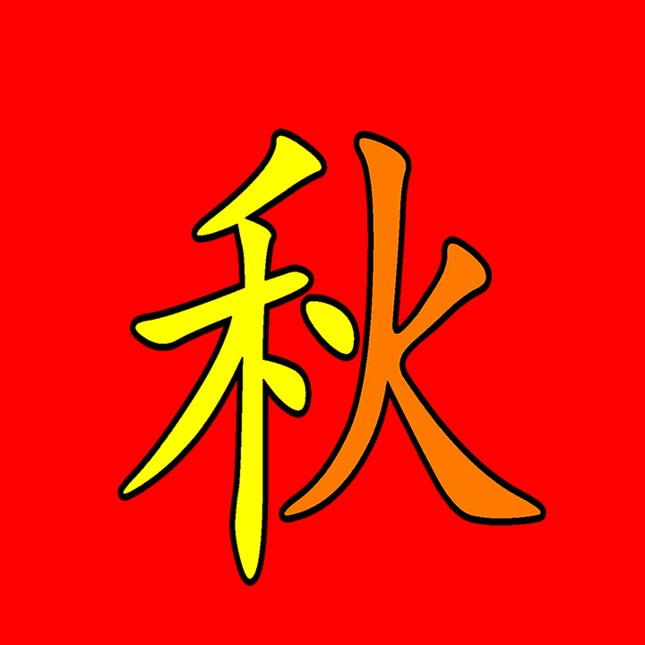

+++
date = "2018-03-29"
title = "Yellow & Orange & Red"

[taxonomies]

tags = [
  "art",
  "chinese",
  "colours",
  "friendship",
  "hotel-chronicles",
  "love",
  "miss-harvest-moon",
  "neighbour",
  "thailand",
  "thisthat",
  "word-art"
]

[extra]
image = "kostatadic-qiukay.jpg"
+++

The whole Chinese character (秋) is the right half her nickname. The orange part is the left half of my nickname (KT). :)

**Related:** [https://www.youtube.com/watch?v=grYFhfGf4hc](https://www.youtube.com/watch?v=grYFhfGf4hc)
