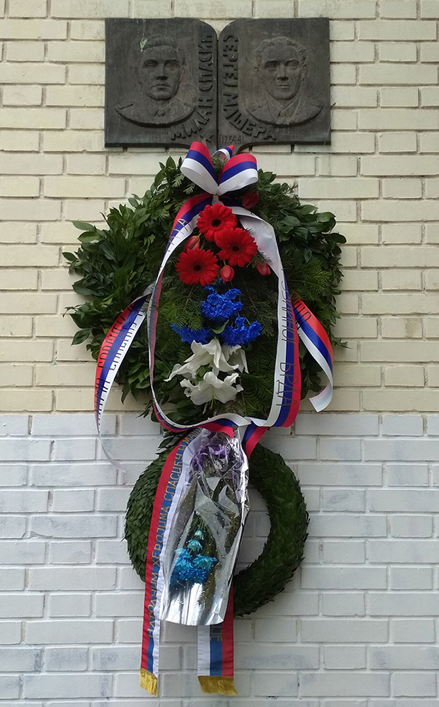

+++
date = "2018-04-18"
title = "Lieutenant Spasic & Lieutenant Mashera"

[taxonomies]

tags = [ "belgrade", "landmarks", "photo", "thisthat", "yugoslavia" ]

[extra]
image = "kostatadic-spasicmashera.jpg"
+++

Photo credit: Milojka Tadic

"During the April War, Spasic, along with his fellow Lieutenant Sergej Mashera, scuttled the destroyer Zagreb in the Bay of Kotor near Tivat to prevent it from falling into the hands of the Italian Royal Navy. Both Spasic and Mashera died in the scuttling." (Wikipedia)

[https://en.wikipedia.org/wiki/Sergej\_Ma%C5%A1era](https://en.wikipedia.org/wiki/Sergej_Ma%C5%A1era) [https://en.wikipedia.org/wiki/Milan\_Spasi%C4%87](https://en.wikipedia.org/wiki/Milan_Spasi%C4%87)
