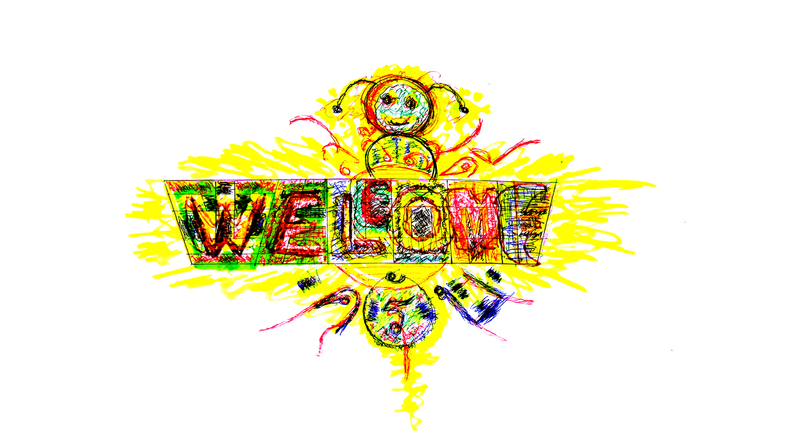

+++
date = "2018-04-21"
title = "Sa-Wat-Dee Khrap"

[taxonomies]

tags = [
  "art",
  "butterfly",
  "colours",
  "drawing",
  "graffiti",
  "sun",
  "thai",
  "thailand",
  "word-art"
]

[extra]
image = "kostatadic-sawatdee.jpg"
+++

Sa-wat-dee (สวัสดี) – hello, hi, welcome, goodbye, good night... (written above WELCOME); the most used phrase in Thailand

Khrap (ครับ) – a polite word used by men (written below WELCOME); it had no meaning, it is just used for expressing respect
