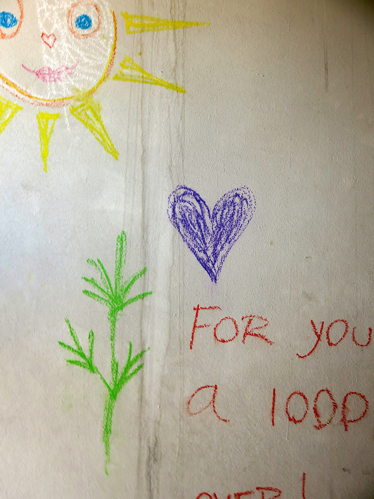
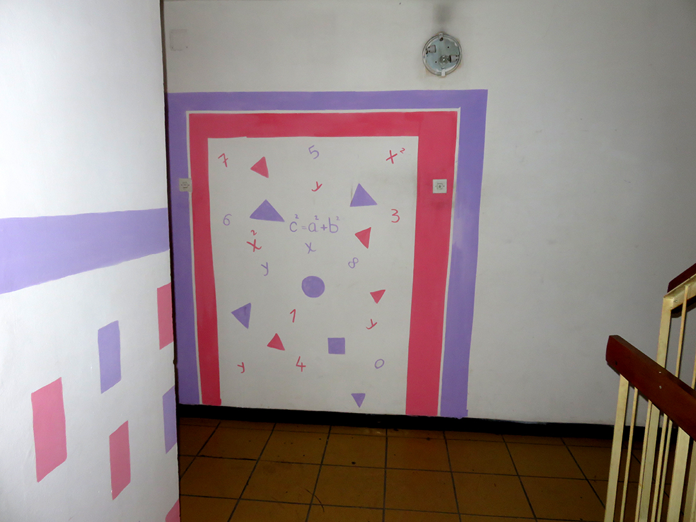
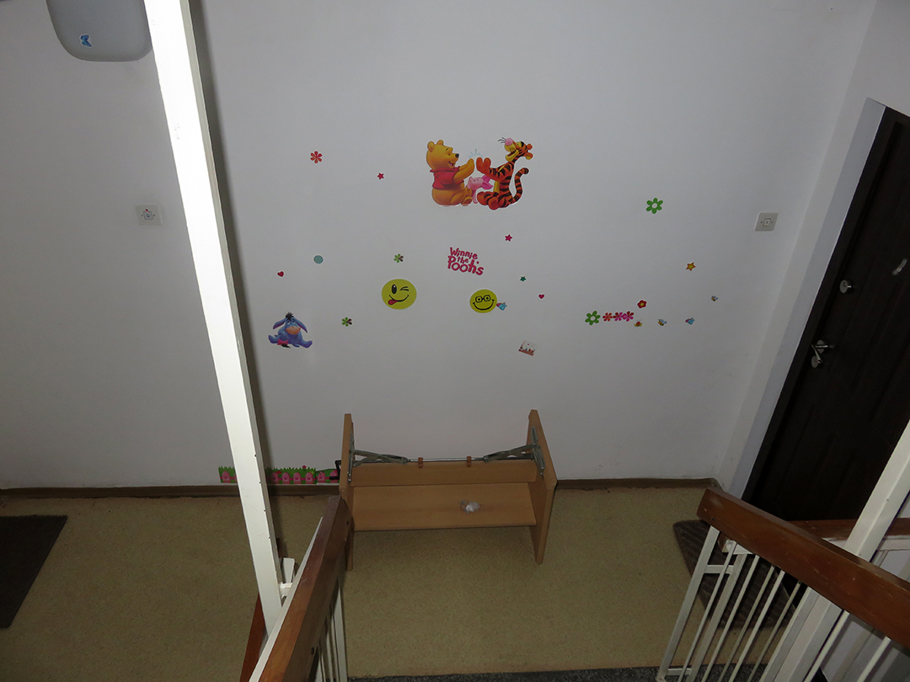
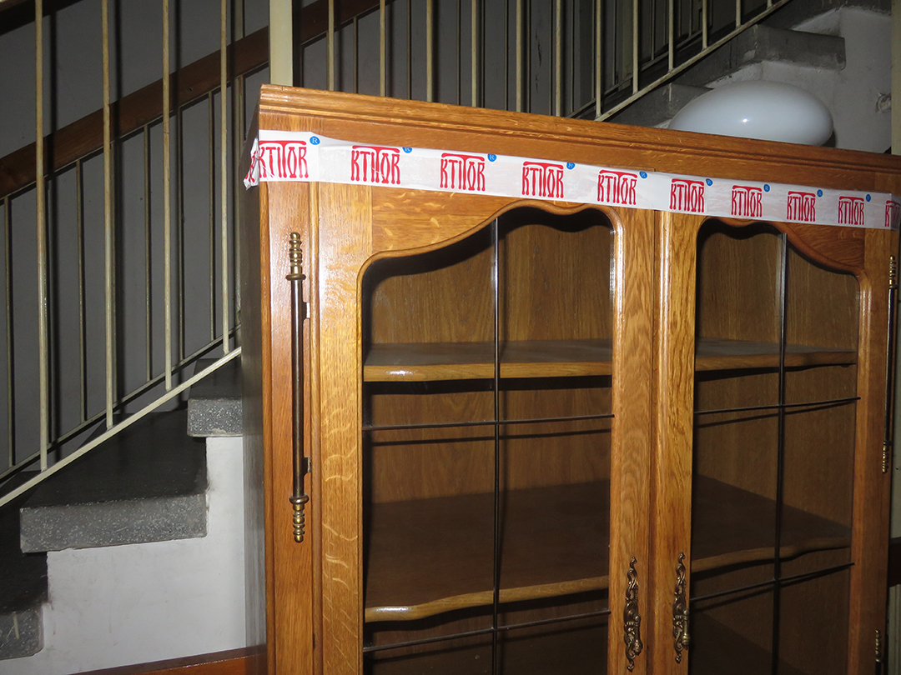
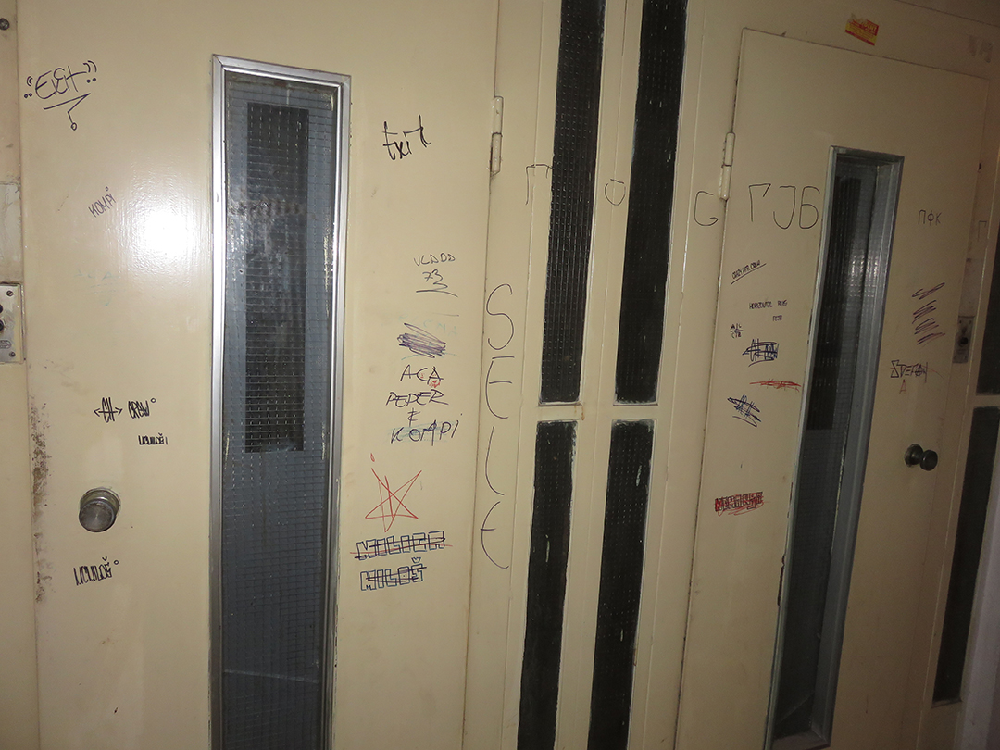
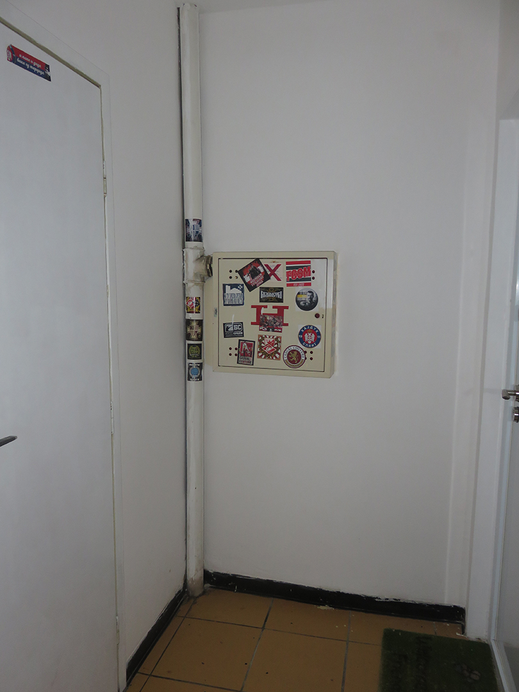

+++
date = "2018-08-26"
title = "Inside My Building"

[taxonomies]

tags = [
  "art",
  "belgrade",
  "colours",
  "neighbour",
  "photo",
  "sun",
  "yugoslavia"
]

[extra]
image = "kostatadic-inside.jpg"
+++

I live on the 12th floor of the concrete building built during the socialist era. The lift has been out of order all day, so I had to go up and down the stairs when I went to the city. It was boring, but also interesting in a way. I met the people I had never seen before, and I had a chance to see the inner side of the building for the first time. I realized that I hadn't known anything about my neighbours before today...

