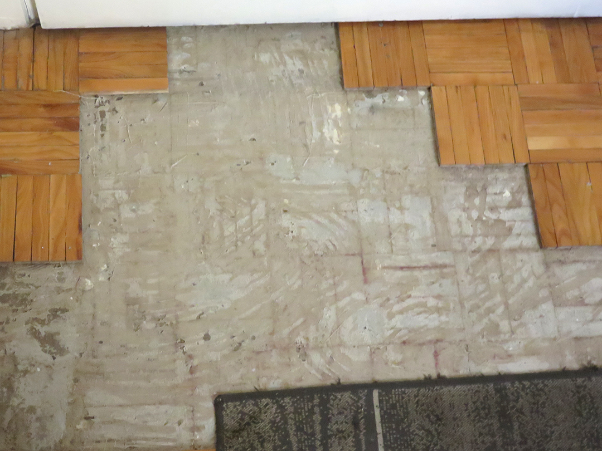

+++
date = "2018-08-26"
title = "Inside My Flat (Art & Life)"

[taxonomies]

tags = [
  "art",
  "belgrade",
  "home",
  "humorous",
  "photo",
  "thisthat",
  "yugoslavia"
]

[extra]
image = "kostatadic-parquet.jpg"
+++

An artist doing some real-life work... In a way, it is similar... You take the pieces of something broken (love, life, society, or – in this case – parquet) and try to make something nice out of them...

