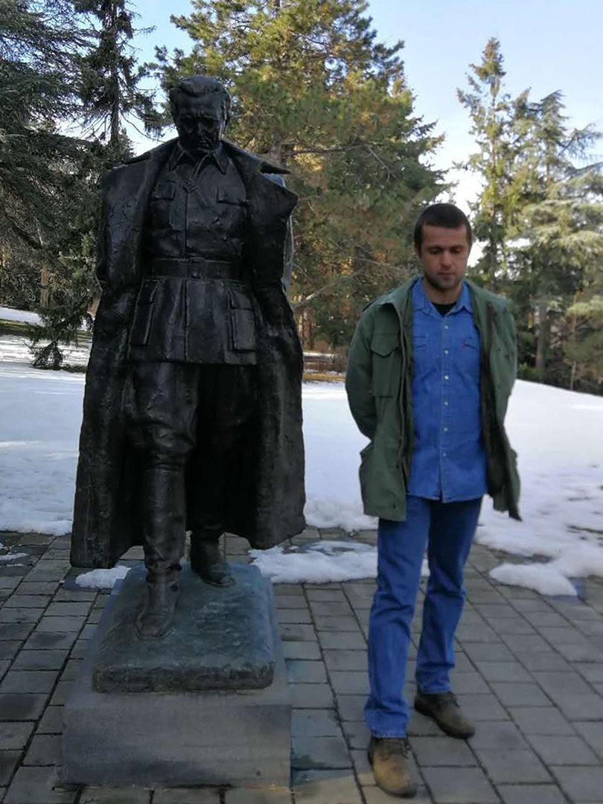

+++
date = "2019-02-04"
title = "KT & JBT"

[taxonomies]

tags = [
  "belgrade",
  "chinese",
  "landmarks",
  "love",
  "photo",
  "surina",
  "thisthat",
  "yugoslavia"
]

[extra]
image = "kostatadic-ktjbt.jpg"
+++

<figure>

<figcaption>

  
[JBT – Josip Broz Tito](https://en.wikipedia.org/wiki/Josip_Broz_Tito)  
  
Photo credit:  
[/blog/surina/](/blog/surina/)

</figcaption>

</figure>
