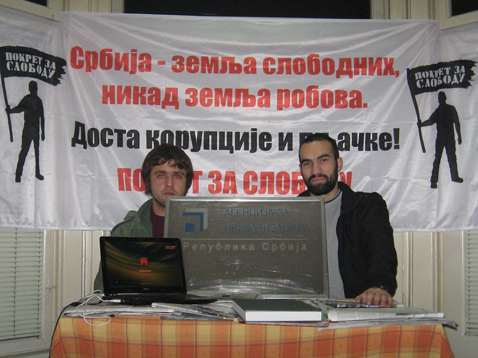

+++
date = "2019-03-10"
title = '"Rebels" & Tables'

[taxonomies]

tags = [
  "belgrade",
  "disgrace",
  "education",
  "friendship",
  "photo",
  "privatisation",
  "shame",
  "thisthat",
  "yugoslavia"
]

[extra]
image = "kostatadic-rebelstables.jpg"
+++

<figure>

<figcaption>

Belgrade, December 2013  
  
[https://freedomfight.net/why-pokret-za-slobodu-demolished-the-board-of-a-state-institution/](https://freedomfight.net/why-pokret-za-slobodu-demolished-the-board-of-a-state-institution/)  
  
NOTE: I have never been a member of the Freedom Fight Movement, nor any other political, religious, NGO or artistic organization… I just helped my friend do the right thing.

</figcaption>

</figure>
