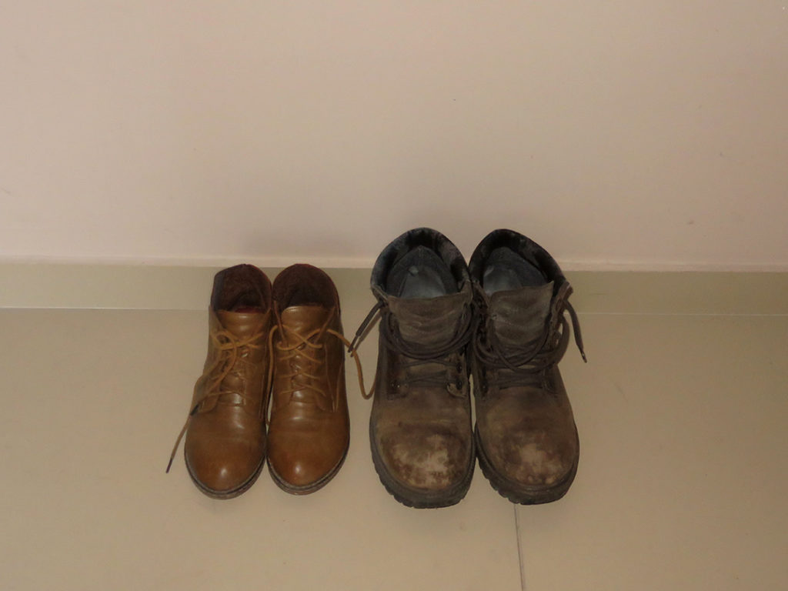

+++
date = "2019-03-13"
title = "Beauty & the Beast Again"

[taxonomies]

tags = [
  "belgrade",
  "chinese",
  "love",
  "photo",
  "surina",
  "thisthat",
  "yugoslavia"
]

[extra]
image = "kostatadic-beautythebeastagain.jpg"
+++

<figure>

<figcaption>

Belgrade, January 2019

</figcaption>

</figure>
